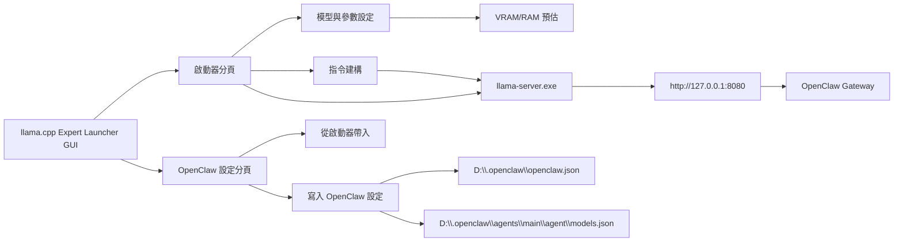

# 🦙 llama.cpp Expert Launcher

llama.cpp 模型啟動器 GUI，專為 Qwen3.6-35B-A3B MoE 模型優化。

## 功能

- **硬體自動偵測**：CPU / RAM / GPU / VRAM / CUDA 版本
- **VRAM/RAM 資源預估**：即時顯示預估使用量
- **使用模式快速選擇**：日常聊天 / Coding / 長文分析 / RAG / 極限 256K / Benchmark
- **多模態支援**：自動偵測 mmproj 檔案，一鍵啟用
- **OpenClaw 設定分頁**：可直接讀取/寫入 `D:\.openclaw\openclaw.json` 與 `agents\main\agent\models.json`
- **一鍵同步**：從當前啟動器參數同步 `contextWindow`、`input(text/image)`、`reserveTokensFloor`
- **內建更新功能**：啟動時自動檢查 GitHub Release，新版時跳出提示讓使用者決定是否更新
- **手動更新檢查**：可手動檢查 Release，並前往安裝檔下載頁（`.exe`/`.msi`/`.zip`）
- **開發者更新 fallback**：在 Git 倉庫環境可用 `git pull --ff-only` 套用程式碼更新
- **收藏參數**：儲存常用配置
- **Port 衝突處理**：自動偵測並提示
- **API 狀態監控**：llama.cpp / LiteLLM / OpenWebUI

## 架構圖



## Releases 流程

1. 確認功能完成並通過基本檢查
	- `python -m py_compile llama_launcher.py`
2. 打包前執行更新流程（必要）
	- 在程式內按「🔎 檢查更新」
	- 若有新版 Release，按「⬆ 套用更新」並前往安裝檔下載
	- 若是開發模式，仍可使用 Git fast-forward 更新
3. 更新文件
	- 更新本 README 的功能清單
	- 若有架構變更，必須同步更新「架構圖」
4. 更新版本資訊與發佈內容
	- 整理變更摘要（新增/修復/破壞性變更）
	- 準備 GitHub Release notes
5. Git 流程
	- commit（Conventional Commits）
	- push 到對應分支
	- 建立 tag（例如 `v1.1.0`）
6. 發佈後驗證
	- 啟動 GUI 並驗證核心功能
	- 驗證 OpenClaw 設定寫入流程

## 版本維護規則

- 功能變更：至少更新功能清單與 release notes。
- 架構變更：必須更新本 README 架構圖。
- 發佈前：必須先完成「檢查更新/套用更新」，再做打包與發佈。
- 發佈前：必須完成語法檢查與基本啟動驗證。

## Release 更新來源設定

- 可透過環境變數指定 Release 倉庫：
	- `LLAMA_LAUNCHER_RELEASE_REPO=owner/repo`
- 若未設定，程式會嘗試從當前 Git `origin` 自動推導。
- 打包版建議在建構時固定設定此值，避免使用者端無法定位更新來源。

## 安裝

```bash
pip install psutil
```

## 使用

```bash
python llama_launcher.py
```

## 啟動排錯

- 若本機找不到 `llama-server.exe`，程式現在會正常開啟 GUI，不會直接退出。
- 此時「啟動伺服器」按鈕會被停用，狀態列會顯示缺少執行檔。
- 請確認 `LLAMA_DIR` 指向正確的 llama.cpp 目錄。

## 實測數據 (RTX 4070 12GB)

| 配置 | VRAM | 狀態 |
|------|------|------|
| moe=32 + 256K | 7.8 GB | 🟢 安全 |
| moe=24 + 32K | 9.7 GB | 🟠 高負載 |
| moe=30 + 256K + mmproj | 10.8 GB | 🔴 爆顯存邊緣 |

## 授權

MIT
